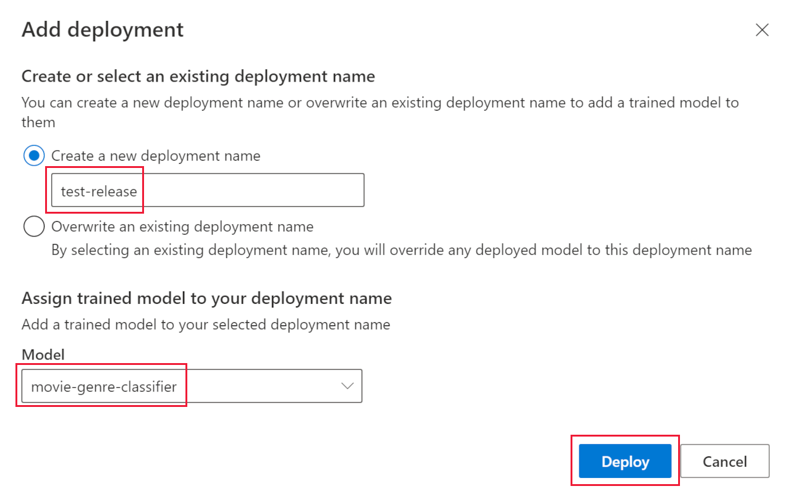
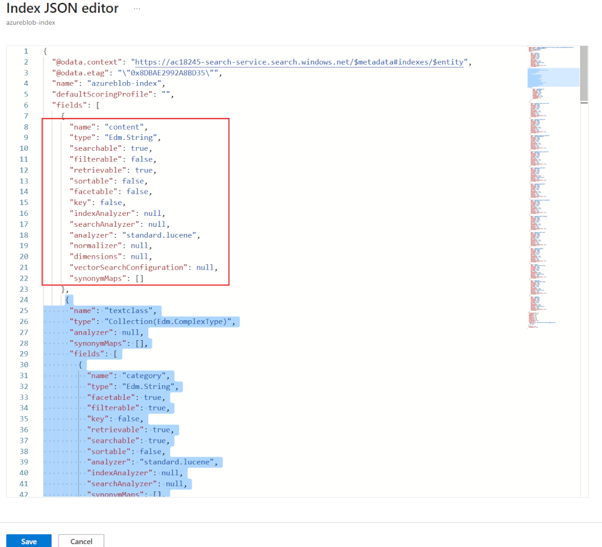

---
lab:
  title: 사용자 지정 클래스로 AI 검색 인덱스 보강
---

# 사용자 지정 클래스로 AI 검색 인덱스 보강

검색 솔루션을 빌드했으며 이제 인덱스에 언어 보강을 위해 Azure AI 서비스를 추가하려고 합니다.

이 연습에서는 Azure AI 검색 솔루션을 만들고 Language Studio 사용자 지정 텍스트 분류 프로젝트의 결과로 인덱스를 보강합니다. 검색 및 분류 모델을 함께 연결하는 함수 앱을 만듭니다.

> **참고** 이 연습을 완료하려면 Microsoft Azure 구독이 필요합니다. 구독이 아직 없다면 [https://azure.com/free](https://azure.com/free?azure-portal=true)에서 평가판을 신청할 수 있습니다.

## Python, VS Code 및 VS Code 확장을 사용하여 개발 환경 설정

이 연습을 완료하려면 이러한 도구를 설치합니다. 이러한 도구 없이도 단계를 따라갈 수 있습니다.

1. [VS Code](https://code.visualstudio.com/) 설치
1. [Azure Core Functions 도구](https://github.com/Azure/azure-functions-core-tools) 설치
1. [VS Code용 Azure 도구 확장](https://code.visualstudio.com/docs/azure/extensions)을 설치합니다.
1. 운영 체제용 [Python 3.8](https://www.python.org/downloads/release/python-380/)을 설치합니다.
1. [VS Code용 Python 확장](https://marketplace.visualstudio.com/items?itemName=ms-python.python) 설치

## Azure 리소스 설정

시간을 절약하려면 이 Azure ARM 템플릿을 선택하여 나중에 연습에서 필요한 리소스를 만듭니다.

### 미리 빌드된 ARM 템플릿 배포

1. [](https://portal.azure.com/#create/Microsoft.Template/uri/https%3A%2F%2Fraw.githubusercontent.com%2FMicrosoftLearning%2Fmslearn-doc-intelligence%2Fmain%2Fcognitive-search%2Fazuredeploy.json). 시작 리소스를 만들려면 이 링크를 선택합니다. 검색 창에 [직접 링크](https://portal.azure.com/#create/Microsoft.Template/uri/https%3A%2F%2Fraw.githubusercontent.com%2FMicrosoftLearning%2Fmslearn-doc-intelligence%2Fmain%2Fcognitive-search%2Fazuredeploy.json)를 복사하여 붙여넣어야 할 수도 있습니다.

    
1. **리소스 그룹**에서 **새로 만들기**를 선택하고, 이름을 **cog-search-language-exe**로 지정합니다.
1. **지역**에서 가까운 [지원되는 지역](https://learn.microsoft.com/azure/ai-services/language-service/concepts/regional-support)을 선택합니다.
1. **리소스 접두사**는 전역적으로 고유해야 하며, 임의의 숫자 및 소문자 접두사를 입력합니다(예: **acs18245**).
1. **위치**에서 위에서 선택한 동일한 지역을 선택합니다.
1. **검토 + 만들기**를 선택합니다.
1. **만들기**를 선택합니다.

    > **참고** 오류가 표시됩니다. **이 리소스를 성공적으로 만들려면 아래 서비스 약관에 동의해야 합니다.** **만들기**를 선택하면 해당 약관에 동의하게 됩니다.

1. **리소스 그룹으로 이동**을 선택하여 만든 모든 리소스를 확인합니다.

    
Azure Cognitive Search 인덱스를 설정하고, Azure 함수를 만들고, 요약에서 영화 장르를 식별하는 Language Studio 프로젝트를 만듭니다.

### 샘플 데이터를 업로드하여 언어 서비스 학습

이 연습에서는 영화에 대한 플롯 요약이 포함된 210개의 텍스트 파일을 사용합니다. 텍스트 파일 이름은 영화 제목입니다. 폴더에는 영화의 장르를 파일에 매핑하는 **movieLabels.json** 파일도 포함되어 있습니다. 각 파일에 대해 다음과 같은 JSON 항목이 있습니다.

```json
{
    "location": "And_Justice_for_All.txt",
    "language": "en-us",
    "classifiers": [
        {
            "classifierName": "Mystery"
        },
        {
            "classifierName": "Drama"
        },
        {
            "classifierName": "Thriller"
        },
        {
            "classifierName": "Comedy"
        }
    ]
},
```

1. GitHub에서 [샘플 데이터](https://github.com/Azure-Samples/cognitive-services-sample-data-files/blob/master/language-service/Custom%20text%20classification/Custom%20multi%20classification%20-%20movies%20summary.zip)를 다운로드하여 머신에 로컬로 저장합니다.

    
1. **사용자 지정 다중 분류 - 영화 summary.zip** 파일을 열고 모든 파일이 포함된 폴더를 추출합니다.

    > **참고** 이러한 파일을 사용하여 Language Studio에서 모델을 학습하고 Azure Cognitive Search의 모든 파일에 대한 인덱스도 생성합니다.

1. [Azure Portal](https://portal.azure.com/)에서 **리소스 그룹**을 선택한 다음 리소스 그룹을 선택합니다.
1. 만든 스토리지 계정(예: **acs18245str**)을 선택합니다.
1. 왼쪽 창에서 **구성**을 선택하고 *Blob 익명 액세스 허용* 설정에서 **사용** 옵션을 선택한 다음 페이지 상단에서 **저장**을 선택합니다.

    

1. 왼쪽에서 **컨테이너**를 선택한 다음 **+ 컨테이너**를 선택합니다.
1. **새 컨테이너** 창의 **이름**에서 **language-studio-training-data**를 입력합니다.
1. **익명 액세스 수준**에서 **컨테이너(컨테이너 및 Blob에 대한 익명 읽기 권한)** 를 선택하고 **만들기**를 선택합니다.
1. 방금 만든 새 컨테이너인 **language-studio-training-data**를 선택합니다.
    
1. 창 위쪽에서 **업로드**를 선택합니다.
1. **BLOB 업로드** 창에서 **파일 찾아보기**를 선택합니다.
1. 샘플 파일을 다운로드한 위치로 이동하여 모든 텍스트(`.txt`) 및 json(`.json`) 파일을 선택합니다.
1. 창에서 **업로드**를 선택합니다.
1. **Blob 업로드** 창이 닫힙니다.

### Language 리소스 만들기

1. 페이지 상단의 탐색경로 링크에서 **홈**을 선택합니다.
1. **+ 리소스 만들기**를 선택하고 *언어 서비스*를 검색합니다.
1. **언어 서비스**에서 **만들기**를 선택합니다.
1. **사용자 지정 텍스트 분류 및 사용자 지정 명명된 엔터티 인식**이 포함된 옵션을 선택합니다.

    
1. **계속하여 리소스 만들기**를 선택합니다.

    
1. **리소스 그룹**에서 **cog-search-language-exe**를 선택합니다.
1. **지역**에서 위에서 사용한 지역을 선택합니다.
1. **이름**에 **learn-language-service-for-custom-text**를 입력합니다. 전역적으로 고유해야 하므로 끝에 임의의 숫자나 문자를 추가해야 할 수도 있습니다.
1. **가격 책정** 계층에서 **S**를 선택합니다.
1. **신규/기존 스토리지 계정**에서 **기존 스토리지 계정**을 선택합니다.
1. **현재 선택한 구독 및 리소스 지역의 스토리지 계정**에서 만든 스토리지 계정(예: **acs18245str**)을 선택합니다.
1. **책임 있는 AI 알림** 약관에 동의한 다음, **검토 + 만들기**를 선택합니다.
1. **만들기**를 실행합니다.
1. 리소스가 배포될 때까지 기다린 다음, **리소스 그룹으로 이동**을 선택합니다.
1. **learn-language-service-for-custom-text**를 선택합니다.

    
1. **개요** 창에서 아래로 스크롤하고 **Language Studio에서 시작**을 선택합니다.
1. 언어 스튜디오에 로그인합니다. 언어 리소스를 선택하라는 메시지가 나타나면 이전에 만든 리소스를 선택합니다.

### Language Studio에서 사용자 지정 텍스트 분류 프로젝트 만들기

1. Language Studio 홈페이지에서 **새로 만들기**를 선택한 다음, **사용자 지정 텍스트 분류**를 선택합니다.

    

1. **다음**을 선택합니다.

    
1. **다중 레이블 분류**를 선택한 다음, **다음**을 선택합니다.

    

1. **이름**에 **movie-genre-classifier**를 입력합니다.
1. **텍스트 기본 언어**에서 **영어(미국)** 를 선택합니다.
1. **설명**에서 **요약에서 영화 장르를 식별할 수 있는 모델**을 입력합니다.
1. **예, 다국어 데이터 세트를 사용합니다**를 선택합니다.
1. **다음**을 선택합니다.

    

1. **Blob Storage 컨테이너**에서 **language-studio-training-data**를 선택합니다.
1. **예, 문서에 이미 레이블이 지정되어 있고 올바른 형식의 JSON 레이블 파일이 있습니다.** 를 선택합니다.
1. **레이블 문서**에서 **movieLabels**를 선택합니다.
1. **다음**을 선택합니다.
1. **프로젝트 만들기**를 선택합니다.

### 사용자 지정 텍스트 분류 AI 모델 학습

1. 왼쪽에서 **학습 작업**을 선택합니다.

    

1. **+ 학습 작업 시작**을 선택합니다.

    
1. **새 모달 학습**에서 **movie-genre-classifier**를 입력합니다.
1. **학습**을 선택합니다.
1. 분류자 모델을 학습하는 데 10분 미만이 소요됩니다. 상태가 **학습 성공**으로 변경될 때까지 기다립니다.

### 사용자 지정 텍스트 분류 AI 모델 배포

1. 왼쪽에서 **모델 배포**를 선택합니다.

    
1. **배포 추가**를 선택합니다.

    
1. **새 배포 이름 만들기**에서 **test-release**를 입력합니다.
1. **모델**에서 **movie-genre-classifier**를 선택합니다.
1. **배포**를 선택합니다.

이 연습의 뒷부분에서 이 웹 페이지를 열어 둡니다.

### Azure AI 검색 인덱스 만들기

이 모델을 사용하여 보강할 수 있는 검색 인덱스를 만듭니다. 이미 다운로드한 영화 요약이 포함된 모든 텍스트 파일을 인덱싱합니다.

1. [Azure Portal](https://portal.azure.com/)에서 **리소스 그룹**을 선택하고 리소스 그룹을 선택한 다음 만든 스토리지 계정(예: **acs18245str**)을 선택합니다.
1. 왼쪽에서 **컨테이너**를 선택한 다음 **+ 컨테이너**를 선택합니다.
1. **새 컨테이너** 창의 **이름**에서 **search-data**를 입력합니다.
1. **익명 액세스 수준**에서 **컨테이너**를 선택합니다.
1. **만들기**를 실행합니다.
1. 방금 만든 새 컨테이너인 **search-data**를 선택합니다.
1. 창 위쪽에서 **업로드**를 선택합니다.
1. **BLOB 업로드** 창에서 **파일 찾아보기**를 선택합니다.
1. 샘플 파일을 다운로드한 위치로 이동하여 텍스트(`.txt`) 파일**만** 선택합니다.
1. 창에서 **업로드**를 선택합니다.
1. **Blob 업로드** 창이 닫힙니다.

### Azure AI 검색으로 문서 가져오기

1. 왼쪽에서 **리소스 그룹**을 선택하고 리소스 그룹을 선택한 다음 검색 서비스를 선택합니다.

1. **데이터 가져오기**를 선택합니다.

    
1. **데이터 원본**에서 **Azure Blob Storage**를 선택합니다.
1. **데이터 원본 이름**에 **movie-summaries**를 입력합니다.
1. **기존 연결 선택**을 선택하고 스토리지 계정을 선택한 다음 방금 만든 컨테이너인 **search-data**를 선택합니다.
1. **인식 기술 추가(선택 사항)** 를 선택합니다.
1. **AI Services 연결** 섹션을 확장한 다음 이전에 만든 Azure AI 서비스를 선택합니다.

    
1. **보강 추가** 섹션을 확장합니다.

    
1. 모든 필드에 기본값을 그대로 두고 **사람 이름 추출**을 선택합니다.
1. **핵심 문구 추출**을 선택합니다.
1. **언어 검색**을 선택합니다.
1. **다음: 대상 인덱스 사용자 지정**을 선택합니다.

    
1. 모든 필드를 기본값으로 두고 **metadata_storage_name**에 대해 **검색 가능** 및 **검색 가능**을 선택합니다.
1. **다음: 인덱서 만들기**를 선택합니다.
1. **제출**을 선택합니다.

인덱서가 실행되고 210개 텍스트 파일의 인덱스가 생성됩니다. 다음 단계를 계속 진행할 때까지 기다릴 필요가 없습니다.

## 검색 인덱스 보강을 위한 함수 앱 만들기

이제 인식 검색 사용자 지정 기술 세트가 호출할 Python 함수 앱을 만듭니다. 함수 앱은 사용자 지정 텍스트 분류자 모델을 사용하여 검색 인덱스를 보강합니다.

1. VScode를 열고 터미널에서 이 GitHub 리포지토리를 컴퓨터에 복제합니다.

    ```bash
    git clone https://github.com/MicrosoftLearning/mslearn-doc-intelligence movie-genre-function
    ```

1. Visual Studio Code에서 방금 복제한 **movie-genre-function** 폴더를 엽니다.

    
1. 필요한 모든 확장을 설치한 경우 프로젝트를 최적화하라는 메시지가 표시됩니다. **예**를 선택합니다.
    
1. Python 인터프리터를 선택합니다. 버전 3.8이어야 합니다.
1. 작업 영역이 업데이트됩니다. 작업 영역 폴더에 연결하라는 메시지가 표시되면 **예**를 선택합니다.
1. **F5**를 눌러 앱을 디버그합니다.

    
    앱이 실행 중인 경우 로컬 테스트에 사용할 수 있는 localhost URL이 표시됩니다.

1. 앱 디버깅을 중지하고 **Shift** + **F5** 키를 누릅니다.

### Azure에 로컬 함수 앱 배포

1. Visual Studio Code에서 **F1**을 눌러 명령 팔레트를 엽니다.
1. 명령 팔레트에서 `Azure Functions: Create Function App in Azure...`을 검색하여 선택합니다.
1. 함수 앱에 대해 전역적으로 고유한 이름을 입력합니다(예: **acs13245str-function-app**).
1. **런타임 스택 선택**에서 **Python 3.8**을 선택합니다.
1. 위에서 사용한 동일한 위치를 선택하세요.

1. 왼쪽 탐색 영역에서 **Azure** 확장을 선택합니다.
    
1. **리소스**를 확장하고 구독 아래의 **함수 앱**을 확장한 다음 함수(예: **acs13245-function-app**)를 마우스 오른쪽 단추로 클릭합니다.
1. **함수 앱에 배포**를 선택합니다. 앱이 배포될 때까지 기다립니다.
1. 앱을 확장하고, **애플리케이션 설정**을 마우스 오른쪽 단추로 클릭하고, **원격 설정 다운로드**를 선택합니다.
1. 왼쪽에서 **탐색기**를 선택한 다음, **local.settings.json**을 선택합니다.

    
함수 앱을 사용자 지정 텍스트 분류 모델에 연결해야 합니다. 다음 단계에 따라 구성 설정을 가져옵니다.

1. 브라우저에서 **Language Studio**로 이동하면 **모델 배포** 페이지에 있어야 합니다.

    
1. 모델을 선택합니다. 그런 다음 **예측 URL 가져오기**를 선택합니다.
1. **예측 URL** 옆에 있는 복사 아이콘을 선택합니다.
1. Visual Studio Code에서 **local.settings.json** 아래쪽에 예측 URL을 붙여넣습니다.
1. **Language Studio**의 왼쪽에서 **프로젝트 설정**을 선택합니다.

    
1. **기본 키** 옆에 있는 복사 아이콘을 선택합니다.
1. Visual Studio Code에서 **local.settings.json** 아래쪽에 기본 키를 붙여넣습니다.
1. 설정을 편집하여 하단에 이 네 줄을 추가하고 엔드포인트를 `TA_ENDPOINT` 값에 복사합니다.

    ```json
    ,
    "TA_ENDPOINT": " [your endpoint] ",
    "TA_KEY": " [your key] ",
    "DEPLOYMENT": "test-release",
    "PROJECT_NAME": "movie-genre-classifier"
    ```

1. 기본 키를 `TA_KEY` 값에 복사합니다.

    ```json
    {
      "IsEncrypted": false,
      "Values": {
        "AzureWebJobsStorage": "DefaultEndpointsProtocol=https;AccountName=...",
        "FUNCTIONS_EXTENSION_VERSION": "~4",
        "FUNCTIONS_WORKER_RUNTIME": "python",
        "WEBSITE_CONTENTAZUREFILECONNECTIONSTRING": "DefaultEndpointsProtocol=https;AccountName=...",
        "WEBSITE_CONTENTSHARE": "acs...",
        "APPINSIGHTS_INSTRUMENTATIONKEY": "6846...",
        "TA_ENDPOINT": "https://learn-languages-service-for-custom-text.cognitiveservices.azure.com/language/analyze-text/jobs?api-version=2022-05-01",
        "TA_KEY": "7105e938ce1...",
        "DEPLOYMENT": "test-release",
        "PROJECT_NAME": "movie-genre-classifier"
      }
    }

    ```

    설정은 프로젝트의 값과 함께 위와 같이 표시됩니다.
 
1. **Ctrl**+**S**를 눌러 **local.settings.json** 변경 내용을 저장합니다.
1. 왼쪽 탐색 영역에서 **Azure** 확장을 선택합니다.
1. **리소스**를 확장하고 구독 아래에서 **함수 앱**을 확장한 다음 **애플리케이션 설정**을 마우스 오른쪽 단추로 클릭하고 **로컬 설정 업로드**를 선택합니다.

### 원격 함수 앱 테스트

함수 앱 및 분류자 모델이 올바르게 작동하는지 테스트하는 데 사용할 수 있는 샘플 쿼리가 있습니다.

1. 왼쪽에서 **탐색기**를 선택하고 **customtextcla** 폴더를 펼친 다음 **sample.dat**를 선택합니다.

    
1. 파일 콘텐츠를 복사합니다.
1. 왼쪽에서 **Azure** 확장을 선택합니다.

    
1. **함수 앱**에서 **함수**를 확장하고 **customtextcla**를 마우스 오른쪽 단추로 클릭한 다음, **지금 함수 실행**을 선택합니다.
1. **요청 본문 입력**에서 복사한 샘플 데이터를 붙여넣은 다음, **Enter** 키를 누릅니다.

    함수 앱은 JSON 결과로 응답합니다.

1. 알림을 확장하여 전체 결과를 확인합니다.

    
    JSON 응답이 다음과 같이 표시됩니다.

    ```json
    {"values": 
        [
            {"recordId": "0", 
            "data": {"text": 
            [
                {"category": "Action", "confidenceScore": 0.99}, 
                {"category": "Comedy", "confidenceScore": 0.96}
            ]}}
        ]
    }
    ```

### 검색 인덱스에 필드 추가

새 함수 앱에서 반환된 보강을 저장할 장소가 필요합니다. 다음 단계에 따라 텍스트 분류 및 신뢰도 점수를 저장할 새 복합 필드를 추가합니다.

1. [Azure Portal](https://portal.azure.com/)에서 검색 서비스가 포함된 리소스 그룹으로 이동한 다음 만든 Cognitive Search 서비스(예: **acs18245-search-service**)를 선택합니다.
1. **개요** 창에서 **인덱스**를 선택합니다.
1. **azurebob-index**를 선택합니다.
1. **JSON 편집**을 선택합니다.
1. 인덱스에 새 필드를 추가하고 콘텐츠 필드 아래에 JSON을 붙여넣습니다.

    ```json
    {
      "name": "textclass",
      "type": "Collection(Edm.ComplexType)",
      "analyzer": null,
      "synonymMaps": [],
      "fields": [
        {
          "name": "category",
          "type": "Edm.String",
          "facetable": true,
          "filterable": true,
          "key": false,
          "retrievable": true,
          "searchable": true,
          "sortable": false,
          "analyzer": "standard.lucene",
          "indexAnalyzer": null,
          "searchAnalyzer": null,
          "synonymMaps": [],
          "fields": []
        },
        {
          "name": "confidenceScore",
          "type": "Edm.Double",
          "facetable": true,
          "filterable": true,
          "retrievable": true,
          "sortable": false,
          "analyzer": null,
          "indexAnalyzer": null,
          "searchAnalyzer": null,
          "synonymMaps": [],
          "fields": []
        }
      ]
    },
    ```

    이제 인덱스가 다음과 비슷할 것입니다.

    
1. **저장**을 선택합니다.

### 함수 앱을 호출하도록 사용자 지정 기술 세트 편집

인식 검색 인덱스를 만들려면 이러한 새 필드를 채우는 방법이 필요합니다. 이전에 만든 기술 세트를 편집하여 함수 앱을 호출합니다.

1. 페이지 상단에서 검색 서비스 링크를 선택합니다(예: **acs18245-search-service | 인덱스**).

1. **개요** 창에서 **기술 세트**를 선택합니다.

    
1. **azureblob-skillset**를 선택합니다.
1. 사용자 지정 기술 세트 정의를 첫 번째 기술 세트로 붙여넣어 아래에 추가합니다.

    ```json
    {
      "@odata.type": "#Microsoft.Skills.Custom.WebApiSkill",
      "name": "Genre Classification",
      "description": "Identify the genre of your movie from its summary",
      "context": "/document",
      "uri": "URI",
      "httpMethod": "POST",
      "timeout": "PT30S",
      "batchSize": 1,
      "degreeOfParallelism": 1,
      "inputs": [
        {
          "name": "lang",
          "source": "/document/language"
        },
        {
          "name": "text",
          "source": "/document/content"
        }
      ],
      "outputs": [
        {
          "name": "text",
          "targetName": "class"
        }
      ],
      "httpHeaders": {}
    },
    ```

함수 앱을 가리키도록 `"uri": "URI"`를 변경해야 합니다.

1. Visual Studio Code에서 **Azure** 확장을 선택합니다.

    
1. **함수** 아래에서 **customtextcla**를 마우스 오른쪽 단추로 클릭한 다음, **함수 URL 복사**를 선택합니다.
1. Azure Portal에서 URI를 복사된 함수 URL로 바꿉니다. 
1. **저장**을 선택합니다.

### 인덱서에서 필드 매핑 편집

이제 보강을 저장할 필드, 함수 앱을 호출하는 기술 세트가 있으며, 마지막 단계는 보강을 배치할 위치를 인식 검색에 알리는 것입니다.

1. 페이지 상단에서 검색 서비스를 선택합니다(예: **acs18245-search-service | 기술 세트** 링크.

    
1. **개요** 창에서 **인덱서**를 선택합니다.
1. **azureblob-indexer**를 선택합니다.
1. **인덱서 정의(JSON)** 를 선택합니다.
1. 이 필드 정의를 출력 필드 섹션의 맨 위에 붙여넣어 새 출력 필드 매핑을 추가합니다.

    ```json
    {
      "sourceFieldName": "/document/class",
      "targetFieldName": "textclass"
    },
    ```

    이제 인덱서 JSON 정의는 다음과 같습니다.

    
1. **저장**을 선택합니다.
1. **다시 설정**을 선택한 다음, **예**를 선택합니다.
1. **실행**을 선택한 다음, **예**를 선택합니다.

    Azure 인지 검색 서비스는 업데이트된 인덱서를 실행합니다. 인덱서는 편집된 사용자 지정 기술 세트를 사용합니다. 기술 세트는 인덱싱되는 문서를 사용하여 함수 앱을 호출합니다. 사용자 지정 텍스트 분류자 모델은 문서의 텍스트를 사용하여 영화의 장르를 시도하고 식별합니다. 모델은 장르 및 신뢰도 수준이 있는 JSON 문서를 반환합니다. 인덱서는 새 출력 필드 매핑을 사용하여 JSON 결과를 인덱스 필드에 매핑합니다.

1. **실행 기록**을 선택합니다.
1. 인덱서가 210개 문서에 대해 성공적으로 실행되었는지 확인합니다.

    
    인덱서의 상태를 업데이트하려면 **새로 고침**을 선택해야 할 수 있습니다.

## 보강된 검색 인덱스 테스트

1. 페이지 상단에서 검색 서비스(예: **acs18245-search-service | 인덱서**.

1. **개요** 창에서 **인덱스**를 선택합니다.
1. **azurebob-index**를 선택합니다.

    
1. **검색**을 선택합니다.
1. 검색 결과를 살펴봅니다.

인덱스 내의 각 문서에는 검색할 수 있는 새 `textclass` 필드가 있어야 합니다. 여기에는 영화 장르가 있는 범주 필드가 포함되어 있습니다. 2개 이상 추가할 수 있습니다. 또한 사용자 지정 텍스트 분류 모델이 식별된 장르에 대해 얼마나 확신하는지 보여 줍니다.

연습을 완료했으므로 더 이상 필요하지 않은 모든 리소스를 삭제합니다.

### 연습 리소스 삭제

1. Azure Portal에서 홈페이지로 이동하여 **리소스 그룹**을 선택합니다.
1. 필요하지 않은 리소스 그룹을 선택한 다음 **리소스 그룹 삭제**를 선택합니다.
