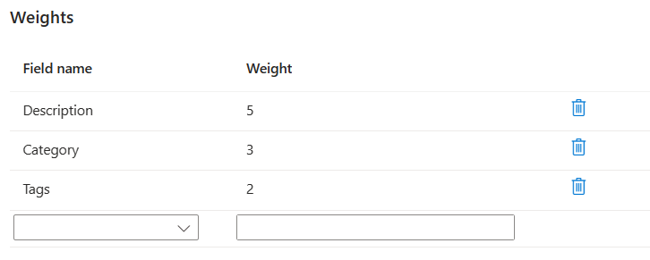

---
lab:
  title: 검색 결과에 향상된 기능 구현
---

# 검색 결과에 향상된 기능 구현

휴가 예약 앱에서 사용하는 기존 검색 서비스가 있습니다. 검색 결과의 관련성이 성사되는 예약 건수에 영향을 주는 것을 보았습니다. 또한 최근에 포르투갈에 호텔을 추가했으므로 포르투갈어를 지원 언어로 제공하고도 싶습니다.

이 연습에서는 채점 프로필을 추가하여 검색 결과의 관련성을 향상시킵니다. 그런 다음 Azure AI 서비스를 사용하여 모든 호텔에 대한 포르투갈어 설명을 추가합니다.

> **참고** 이 연습을 완료하려면 Microsoft Azure 구독이 필요합니다. 구독이 아직 없다면 [https://azure.com/free](https://azure.com/free?azure-portal=true)에서 평가판을 신청할 수 있습니다.

## Azure 리소스 만들기

Azure AI 검색 서비스를 만들고 샘플 호텔 데이터를 가져옵니다.

1. [Azure Portal](https://portal.azure.com/learn.docs.microsoft.com?azure-portal=true)에 로그인합니다.
1. **+ 리소스 만들기**를 선택합니다.
1. **검색**을 검색한 다음, **Azure AI 검색**을 선택합니다.
1. **만들기**를 실행합니다.
1. 리소스 그룹에서 **새로 만들기**를 선택하고, 이름을 **learn-advanced-search**로 지정합니다.
1. **서비스 이름**에 **advanced-search-service-12345**를 입력합니다. 이름은 전역적으로 고유해야 하므로 이름 끝에 난수를 추가합니다.
1. 자신과 가까운 지원되는 지역을 선택합니다.
1. **가격 책정 계층**의 기본값을 사용합니다.
1. **검토 + 만들기**를 선택합니다.
1. **만들기**를 선택합니다.
1. 리소스가 배포될 때까지 기다린 다음, **리소스로 이동**을 선택합니다.

### 검색 서비스로 샘플 데이터 가져오기

샘플 데이터를 가져옵니다.

1. **개요** 창에서 **데이터 가져오기**를 선택합니다.

    
1. **데이터 가져오기** 창의 **데이터 원본** 드롭다운에서 **샘플**을 선택합니다.
1. **호텔 샘플**을 선택합니다.

1. **인지 기술 추가(선택 사항)** 탭에서 **AI 서비스 연결**을 확장한 다음 **새 AI 서비스 리소스 만들기**를 선택합니다.

    

### 번역을 지원하는 Azure AI 서비스 만들기

1. 새 탭에서 Azure Portal에 로그인합니다.
1. **리소스 그룹**에서 **learn-advanced-search**를 선택합니다.
1. **지역**에서 검색 서비스에 대해 선택한 동일한 지역을 선택합니다.
1. **이름**에 **learn-cognitive-translator-12345**를 입력하거나 원하는 대로 아무 이름이나 지정합니다. 이름은 전역적으로 고유해야 하므로 이름 끝에 난수를 추가합니다.
1. **가격 책정 계층**에서 **표준 S0**을 선택합니다.
1. **이 상자를 체크함으로써 본인은 아래의 모든 약관을 읽고 이해했음을 인정합니다**를 체크합니다.
1. **검토 + 만들기**를 선택합니다.
1. **만들기**를 선택합니다.
1. 리소스가 만들어지면 탭을 닫습니다.

### 번역 보강 추가

1. **인식 기술 추가(선택 사항)** 탭에서 새로 고침을 선택합니다.
1. 새 서비스인 **learn-cognitive-translator-12345**를 선택합니다.
1. **보강 추가** 섹션을 확장합니다.
    
1. **텍스트 번역**을 선택하고 **대상 언어**를 **포르투갈어**로 변경한 다음 **필드 이름**을**Description_pt**로 변경합니다.
1. **다음: 대상 인덱스 사용자 지정**을 선택합니다.

### 번역된 텍스트를 저장하도록 필드 변경

1. **대상 인덱스 사용자 지정** 탭에서 필드 목록의 아래쪽으로 스크롤하고 **Description_pt** 필드에 대해 **분석기**를 **포르투갈어(포르투갈) - Microsoft**로 변경합니다.
1. **다음: 인덱서 만들기**를 선택합니다.
1. **제출**을 선택합니다.

    인덱스가 생성되고 인덱서가 실행되고 샘플 호텔 데이터가 포함된 50개의 문서를 가져옵니다.
1. **개요** 창에서 **인덱스**를 선택한 다음 **hotels-sample-index**를 선택합니다.
1. **검색**을 선택하여 인덱스의 모든 문서에 대한 JSON을 확인합니다.
1. 결과에서 **Description_pt**를 검색(**Ctrl + F**를 사용해도 됨)하고 영어 설명의 포르투갈어 번역이 아니라 다음과 같이 표시되는 것을 확인합니다.

    ```json
    "Description_pt": "45",
    ```

Azure Portal은 문서의 첫 번째 필드를 번역해야 한다고 가정합니다. 따라서 현재 번역 기술을 사용하여 `HotelId`를 번역합니다.

### 문서에서 올바른 필드를 번역하도록 기술 세트를 업데이트합니다.

1. 페이지 위에서 검색 서비스인 **advanced-search-service-12345 |Indexes** 링크를 선택합니다.
1. 왼쪽 창의 검색 관리에서 **기술 세트**를 선택한 다음, **hotels-sample-skillset**를 선택합니다.
1. JSON 문서를 편집하고 줄 11을 다음으로 변경합니다.

    ```json
    "context": "/document/Description",
    ```

1. 12줄에서 기본값을 언어에서 영어로 변경합니다.

    ```json
    "defaultFromLanguageCode": "en",
    ```

1. 줄 18의 원본 필드를 다음으로 변경합니다.

    ```json
    "source": "/document/Description"
    ```

1. **저장**을 선택합니다.
1. 페이지 위에서 검색 서비스인 **advanced-search-service-12345 | Skillsets** 링크를 선택합니다.
1. **개요** 창에서 **인덱서**를 선택한 다음 **hotels-sample-indexer**를 선택합니다.
1. **인덱서 정의(JSON)** 를 선택합니다.
1. 줄 21의 원본 필드 이름을 다음으로 변경합니다.

    ```json
    "sourceFieldName": "/document/Description/Description_pt",
    ```

1. **저장**을 선택합니다.
1. **다시 설정**을 선택한 다음, **예**를 선택합니다.
1. **실행**을 선택한 다음, **예**를 선택합니다.

### 업데이트된 인덱스 테스트

1. 페이지 위에서 검색 서비스인 **advanced-search-service-12345 | Indexes** 링크를 선택합니다.
1. **개요** 창에서 **인덱스**를 선택한 다음 **hotels-sample-index**를 선택합니다.
1. **검색**을 선택하여 인덱스의 모든 문서에 대한 JSON을 확인합니다.
1. 결과에서 **Description_pt**를 검색하면 이제 포르투갈어 설명이 있습니다.

    ```json
    "Description_pt": "O maior resort durante todo o ano da área oferecendo mais de tudo para suas férias – pelo melhor valor!  O que você pode desfrutar enquanto estiver no resort, além das praias de areia de 1,5 km do lago? Confira nossas atividades com certeza para excitar tanto os jovens quanto os jovens hóspedes do coração. Temos tudo, incluindo ser chamado de \"Propriedade do Ano\" e um \"Top Ten Resort\" pelas principais publicações.",
    ```

1. 이제 호수 뷰가 있는 호텔을 검색합니다. 간단한 검색을 사용하여 시작하지만 `HotelName`, `Description`, `Category` 및 `Tags`만 반환합니다. **쿼리 문자열**에 다음 검색을 입력합니다.

    `lake + view&$select=HotelName,Description,Category,Tags&$count=true`

    결과를 살펴보고 `lake` 및 `view` 검색어와 일치하는 필드를 찾습니다. 이 호텔과 위치는 다음과 같습니다.

    ```json
    {
      "@search.score": 0.9433406,
      "HotelName": "Lady Of The Lake B & B",
      "Description": "Nature is Home on the beach.  Save up to 30 percent. Valid Now through the end of the year. Restrictions and blackout may apply.",
      "Category": "Luxury",
      "Tags": [
        "laundry service",
        "concierge",
        "view"
      ]
    },
    ```

이 호텔은 `HotelName` 필드에서 호수라는 용어, `Tags` 필드에서 뷰라는 용어와 일치했습니다. 호텔 이름에 대해 `Description` 필드에서 용어의 일치를 향상시키는 것이 좋습니다. 이 호텔은 결과에서 마지막에 오는 것이 이상적입니다.

## 채점 프로필을 추가하여 검색 결과 개선

1. **채점 프로필 탭**을 선택합니다.
1. **+ 채점 프로필 추가**를 선택합니다.
1. **프로필 이름**에 **boost-description-categories**를 입력합니다.
1. **가중치** 아래에 다음 필드와 가중치를 추가합니다.

    
1. **필드 이름**에서 **설명**을 선택합니다.
1. **가중치**에 **5**를 입력합니다.
1. **필드 이름**에서 **범주**를 선택합니다.
1. **가중치**에 **3**을 입력합니다.
1. **필드 이름**에서 **태그**를 선택합니다.
1. **가중치**에 **2**를 입력합니다.
1. **저장**을 선택합니다.
1. 상단에서 **저장**을 선택합니다.

### 업데이트된 인덱스 테스트

1. **hotels-sample-index** 페이지의 **검색 탐색기** 탭으로 돌아갑니다.
1. **쿼리 문자열**에서 이전과 동일한 검색을 입력합니다.

    `lake + view&$select=HotelName,Description,Category,Tags&$count=true`

    검색 결과를 확인합니다.

    ```json
    {
      "@search.score": 3.5707965,
      "HotelName": "Lady Of The Lake B & B",
      "Description": "Nature is Home on the beach.  Save up to 30 percent. Valid Now through the end of the year. Restrictions and blackout may apply.",
      "Category": "Luxury",
      "Tags": [
        "laundry service",
        "concierge",
        "view"
      ]
    }
    ```

    검색 점수가 **0.9433406**에서 **3.5707965**로 증가했습니다. 그러나 다른 모든 호텔의 계산 점수가 더 높습니다. 이 호텔은 이제 결과에서 마지막에 옵니다.

## 정리

연습을 완료했으므로 더 이상 필요하지 않은 모든 리소스를 삭제합니다.

1. Azure Portal에서 **리소스 그룹**을 선택합니다.
1. 더 이상 필요하지 않은 리소스 그룹을 선택한 다음 **리소스 그룹 삭제**를 선택합니다.
