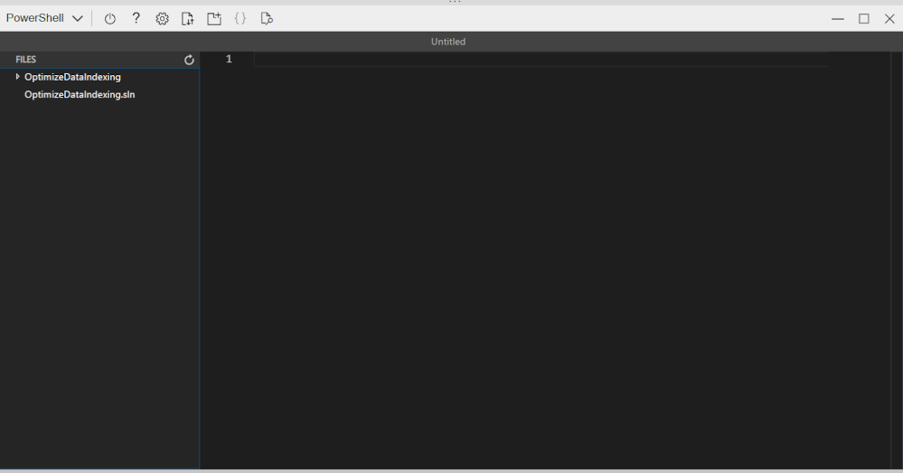
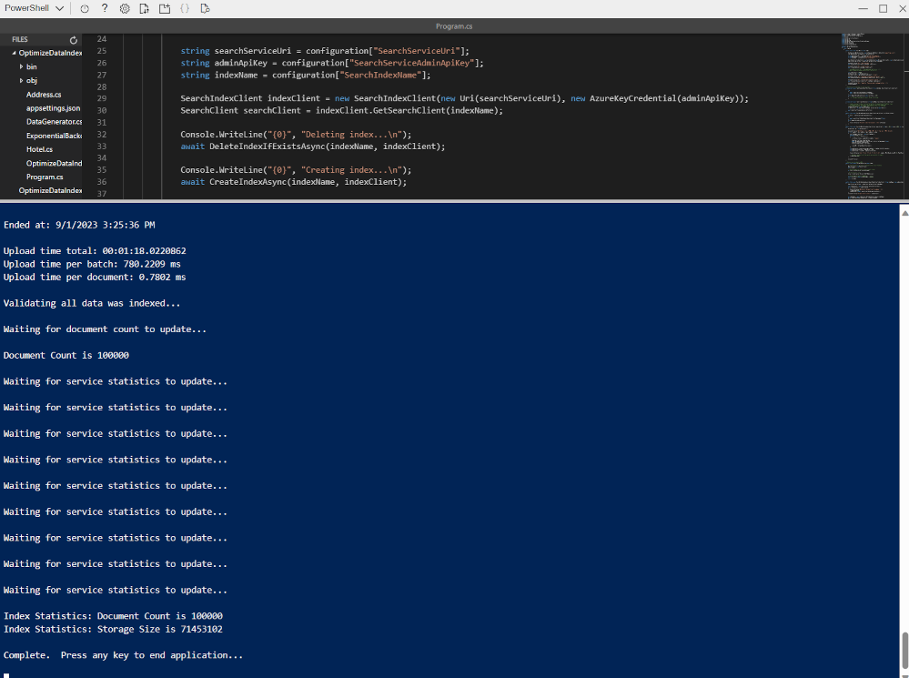

---
lab:
  title: 푸시 API를 사용하여 인덱스에 추가
---

# 푸시 API를 사용하여 인덱스에 추가

Azure AI 검색 인덱스를 만들고 C# 코드를 사용하여 해당 인덱스에 문서를 업로드하는 방법을 탐색하려고 합니다.

이 연습에서는 기존 C# 솔루션을 복제하고 실행하여 문서를 업로드할 최적의 일괄 처리 크기를 계산합니다. 그런 다음, 이 일괄 처리 크기를 사용하고 스레드 접근 방식을 사용하여 문서를 효과적으로 업로드합니다.

> **참고** 이 연습을 완료하려면 Microsoft Azure 구독이 필요합니다. 구독이 아직 없다면 [https://azure.com/free](https://azure.com/free?azure-portal=true)에서 평가판을 신청할 수 있습니다.

## Azure 리소스 설정

시간을 절약하려면 이 Azure Resource Manager 템플릿을 선택하여 나중에 연습에서 필요한 리소스를 만듭니다.

1. [Azure 에 리소스 배포](https://portal.azure.com/#create/Microsoft.Template/uri/https%3A%2F%2Fraw.githubusercontent.com%2FMicrosoftLearning%2Fmslearn-knowledge-mining%2Fmain%2FLabfiles%2F07-exercise-add-to-index-use-push-api%20lab-files%2Fazuredeploy.json) - 이 링크를 선택하여 Azure AI 리소스를 만듭니다.
    
1. **리소스 그룹**에서 **새로 만들기**를 선택하고, 이름을 **cog-search-language-exe**로 지정합니다.
1. **지역**에서 가까운 [지원되는 지역](/azure/ai-services/language-service/custom-text-classification/service-limits#regional-availability)을 선택합니다.
1. **리소스 접두사**는 전역적으로 고유해야 하며, 임의의 숫자 및 소문자 접두사를 입력합니다(예: **acs118245**).
1. **위치**에서 위에서 선택한 동일한 지역을 선택합니다.
1. **검토 + 만들기**를 선택합니다.
1. **만들기**를 선택합니다.
1. 배포가 완료되면 **리소스 그룹으로 이동**을 선택하여 만든 모든 리소스를 확인합니다.

    

### Azure AI 검색 서비스 REST API 정보 복사

1. 리소스 목록에서 만든 검색 서비스를 선택합니다. 위의 예에서는 **acs118245-search-service**입니다.
1. 검색 서비스 이름을 텍스트 파일에 복사합니다.

    
1. 왼쪽에서 **키**를 선택한 다음, **기본 관리자 키**를 동일한 텍스트 파일에 복사합니다.

### 예제 코드 다운로드

Azure Portal 상단에 있는 Cloud Shell 단추를 선택하여 Azure Cloud Shell을 엽니다.
> **참고** Azure Storage 계정을 만들라는 메시지가 표시되면 **스토리지 만들기**을 선택합니다.

1. 시작이 완료되면 Cloud Shell에서 다음을 실행하여 다음 코드 예 리포지토리를 복제합니다.

    ```powershell
    git clone https://github.com/Azure-Samples/azure-search-dotnet-scale.git samples
    ```

1. 다음을 실행하여 새로 만들어진 디렉터리로 변경합니다.

    ```powershell
    cd samples
    ```

1. 다음을 실행합니다.

    ```powershell
    code ./optimize-data-indexing/v11
    ```

1. 그러면 `/optimize-data-indexing/v11` 폴더에 있는 Cloud Shell 내의 코드 편집기가 열립니다.

    
1. 왼쪽 탐색 영역에서 **OptimizeDataIndexing** 폴더를 확장한 다음, **appsettings.json** 파일을 선택합니다.

    
1. 검색 서비스 이름 및 기본 관리 키를 붙여넣습니다.

    ```json
    {
      "SearchServiceUri": "https://acs118245-search-service.search.windows.net",
      "SearchServiceAdminApiKey": "YOUR_SEARCH_SERVICE_KEY",
      "SearchIndexName": "optimize-indexing"
    }
    ```

    설정 파일은 위와 유사해야 합니다.
1. **CTRL + S**를 눌러 변경 내용을 저장합니다.
1. **OptimizeDataIndexing.csproj** 파일을 선택합니다. <!-- Added this and the next two steps in case we can't update the file in the repo that holds these (seems to be separate from the other labs)-->
1. 다섯 번째 줄에서 `<TargetFramework>netcoreapp3.1</TargetFramework>`를 `<TargetFramework>net7.0</TargetFramework>`로 변경합니다. <!--- can be removed if no longer needed based on the above-->
1. **CTRL + S**를 눌러 변경 내용을 저장합니다.<!--- can be removed if no longer needed based on the above-->
1. 터미널에 `cd ./optimize-data-indexing/v11/OptimizeDataIndexing`을 입력한 다음 **Enter** 키를 눌러 올바른 디렉터리로 변경합니다.
1. **Program.cs** 파일을 선택합니다. 그런 다음 터미널에 `dotnet run`을 입력하고 **Enter** 키를 누릅니다.

    
출력에 따르면 이 경우 가장 성능이 좋은 일괄 처리 크기는 900개 문서입니다. 초당 3.688MB에 도달합니다.

### 코드를 편집하여 스레딩, 백오프, 재시도 전략 구현

스레드를 사용하여 문서를 검색 인덱스에 업로드하도록 앱을 변경할 준비가 된 주석 처리된 코드가 있습니다.

1. **Program.cs**를 선택했는지 확인합니다.

    
1. 38행과 39행을 다음과 같이 주석으로 처리합니다.

    ```csharp
    //Console.WriteLine("{0}", "Finding optimal batch size...\n");
    //await TestBatchSizesAsync(searchClient, numTries: 3);
    ```

1. 41~49줄의 주석 처리를 제거합니다.

    ```csharp
    long numDocuments = 100000;
    DataGenerator dg = new DataGenerator();
    List<Hotel> hotels = dg.GetHotels(numDocuments, "large");

    Console.WriteLine("{0}", "Uploading using exponential backoff...\n");
    await ExponentialBackoff.IndexDataAsync(searchClient, hotels, 1000, 8);

    Console.WriteLine("{0}", "Validating all data was indexed...\n");
    await ValidateIndexAsync(indexClient, indexName, numDocuments);
    ```

    일괄 처리 크기와 스레드 수를 제어하는 ​​코드는 `await ExponentialBackoff.IndexDataAsync(searchClient, hotels, 1000, 8)`입니다. 일괄 처리 크기는 1,000이고 스레드는 8개입니다.

    
    코드는 위와 같아야 합니다.

1. 변경 내용을 저장하려면 **Ctrl**+**S**를 누릅니다.
1. 터미널을 선택한 다음, 아직 종료하지 않았다면 아무 키나 눌러 실행 중인 프로세스를 종료합니다.
1. 터미널에서 `dotnet run`을 실행합니다.

    
    앱은 8개의 스레드를 시작한 다음, 각 스레드가 콘솔에 새 메시지 쓰기를 마치면 다음을 수행합니다.

    ```powershell
    Finished a thread, kicking off another...
    Sending a batch of 1000 docs starting with doc 57000...
    ```

    100,000개의 문서가 업로드되면 앱에서 요약이 작성됩니다(완료하는 데 시간이 걸릴 수 있음).

    ```powershell
    Ended at: 9/1/2023 3:25:36 PM
    
    Upload time total: 00:01:18:0220862
    Upload time per batch: 780.2209 ms
    Upload time per document: 0.7802 ms
    
    Validating all data was indexed...
    
    Waiting for service statistics to update...
    
    Document Count is 100000
    
    Waiting for service statistics to update...
    
    Index Statistics: Document Count is 100000
    Index Statistics: Storage Size is 71453102
    
    ``````

`TestBatchSizesAsync` 프로시저의 코드를 탐색하여 코드가 일괄 처리 크기 성능을 테스트하는 방법을 확인합니다.

`IndexDataAsync` 프로시저의 코드를 탐색하여 코드가 스레딩을 관리하는 방법을 확인합니다.

`ExponentialBackoffAsync`의 코드를 탐색하여 코드가 지수 백오프 재시도 전략을 구현하는 방법을 확인합니다.

문서가 Azure Portal의 인덱스로 추가되었는지 검색하고 확인할 수 있습니다.


### 연습 리소스 삭제

연습을 완료했으므로 더 이상 필요하지 않은 모든 리소스를 삭제합니다. 머신에 복제된 코드로 시작합니다. 그런 다음, Azure 리소스를 삭제합니다.

1. **Azure Portal**에서 리소스 그룹을 선택합니다.
1. 이 연습을 위해 만든 리소스 그룹을 선택합니다.
1. **리소스 그룹 삭제**를 선택합니다. 
1. 삭제를 확인한 다음 **삭제**를 선택합니다.
1. 필요하지 않은 리소스를 선택한 다음, **삭제**를 선택합니다.
