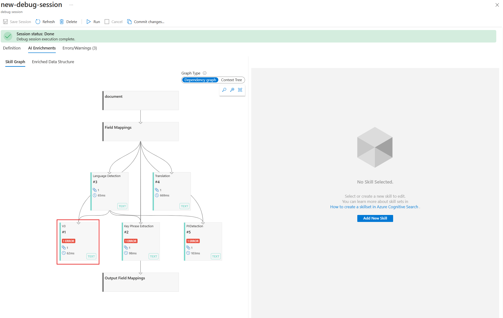
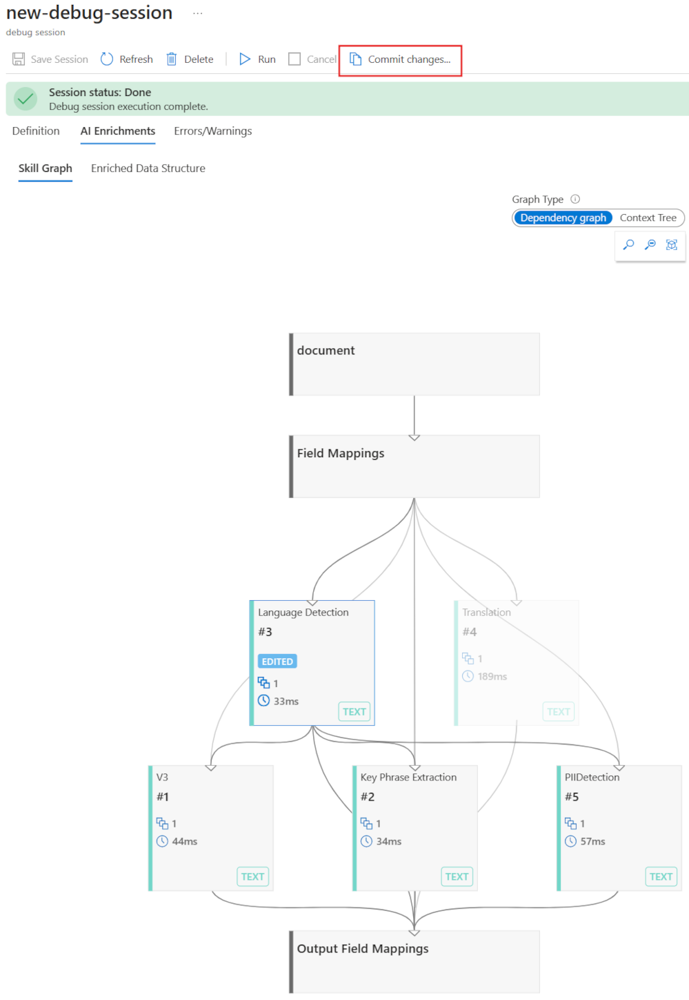

---
lab:
  title: 검색 문제 디버그
---

# 검색 문제 디버그

검색 솔루션을 빌드했지만 인덱서에 몇 가지 경고가 있음을 확인했습니다.

이 연습에서는 Azure AI 검색 솔루션을 만들고 일부 샘플 데이터를 가져온 다음 인덱서에서 경고를 해결합니다.

> **참고** 이 연습을 완료하려면 Microsoft Azure 구독이 필요합니다. 구독이 아직 없다면 [https://azure.com/free](https://azure.com/free?azure-portal=true)에서 평가판을 신청할 수 있습니다.

## 검색 솔루션 만들기

디버그 세션 사용을 시작하기 전에 Azure Cognitive Search 서비스를 만들어야 합니다.

1. [Azure에 리소스 배포](https://portal.azure.com/#create/Microsoft.Template/uri/https%3A%2F%2Fraw.githubusercontent.com%2FAzure-Samples%2Fazure-search-knowledge-mining%2Fmain%2Fazuredeploy.json) - 이 링크를 선택하여 Azure Portal에 필요한 모든 리소스를 배포합니다.

    

1. **리소스 그룹**에서 **새로 만들기**를 선택합니다.
1. **acs-cognitive-search-exercise**를 입력합니다.
1. 가장 가까운 **지역**을 선택합니다.
1. **리소스 접두사**의 경우 **acslearnex**를 입력하고 임의의 숫자 또는 문자 조합을 추가하여 스토리지 이름이 고유하도록 합니다.
1. 위치의 경우 위에서 사용한 것과 동일한 지역을 선택합니다.
1. 창 아래쪽에서 **검토 + 만들기**를 선택합니다.
1. 리소스가 배포될 때까지 기다린 다음, **리소스 그룹으로 이동**을 선택합니다.

## 샘플 데이터 가져오기

리소스를 만들면 이제 원본 데이터를 가져올 수 있습니다.

1. 나열된 리소스에서 검색 서비스를 선택합니다.

1. **개요** 창에서 **데이터 가져오기**를 선택합니다.

      

1. 데이터 가져오기 창에서 데이터 원본에 대해 **샘플**을 선택합니다.

      

1. 샘플 목록에서 **hotels-sample**을 선택합니다.
1. **다음: 인식 기술 추가(선택 사항)** 를 선택합니다.
1. **보강 추가** 섹션을 확장합니다.

    

1. **텍스트 인식 기술**을 선택합니다.
1. **다음: 대상 인덱스 사용자 지정**을 선택합니다.
1. 기본값을 그대로 두고 **다음:인덱서 만들기**를 선택합니다.
1. **제출**을 선택합니다.

## 디버그 세션을 사용하여 인덱서에 대한 경고 해결

이제 인덱서가 50개 문서를 수집하기 시작합니다. 그러나 인덱서의 상태를 확인하면 경고가 있음을 알 수 있습니다.

1. 왼쪽 창에서 **디버그 세션**을 선택합니다.

1. **+ 디버그 세션 추가**를 선택합니다.

1. 스토리지 연결 문자열에서 **기존 연결 선택**을 선택한 다음 스토리지 계정을 선택합니다.

    
1. 새 컨테이너를 추가하려면 **+ 컨테이너**를 선택합니다. 이름을 **acs-debug-storage**로 지정합니다.

    

1. **익명 액세스 수준**을 **컨테이너(컨테이너 및 Blob에 대한 익명 읽기 권한)** 로 설정합니다.

    > **참고**: 이 옵션을 선택하려면 Blob 익명을 사용하도록 설정해야 할 수도 있습니다. 이렇게 하려면 스토리지 계정에서 **구성**으로 이동하여 **Blob 익명 액세스 허용**을 **사용**으로 설정한 다음 **저장**을 선택합니다.

1. **만들기**를 실행합니다.
1. 목록에서 새 컨테이너를 선택한 다음 **선택**을 선택합니다.
1. **인덱서 템플릿**으로 **hotel-sample-indexer**를 선택합니다.
1. **세션 저장**을 선택합니다.

    종속성 그래프는 각 문서에 대해 세 가지 기술에 오류가 있음을 보여 줍니다.
    

1. **V3**를 선택합니다.
1. 기술 세부 정보 창에서 **오류/경고(1)** 를 선택합니다.
1. 세부 정보를 볼 수 있도록 **메시지** 열을 확장합니다.

    세부 정보는 다음과 같습니다.

    *잘못된 언어 코드 '(알 수 없음)'. 지원되는 언어: ar,cs,da,de,en,es,fi,fr,hu,it,ja,ko,nl,no,pl,pt-BR,pt-PT,ru,sv,tr,zh-Hans. 자세한 내용은 https://aka.ms/language-service/language-support를 참조하세요.*

    종속성 그래프를 다시 살펴보면 언어 감지 기술에 경고가 포함된 세 가지 기술에 대한 출력이 있습니다. 또한 오류를 일으키는 기술 입력은 `languageCode`입니다.

1. 종속성 그래프에서 **언어 감지**를 선택합니다.

    
    기술 설정 JSON을 살펴보면 언어를 추론하는 데 사용되는 필드는 `HotelId`입니다.

    이 필드는 기술에서 ID에 따라 언어를 계산할 수 없으면 오류가 발생합니다.

## 인덱서에 대한 경고 해결

1. 입력 아래에서 **원본**를 선택하고 필드를 `/document/Description`으로 변경합니다.
    
1. **저장**을 선택합니다.
1. **실행**을 선택합니다.

    

    인덱서에는 더 이상 오류나 경고가 없어야 합니다. 이제 기술 세트를 업데이트할 수 있습니다.

1. **변경 내용 커밋...** 을 선택합니다.

    
1. **확인**을 선택합니다.

1. 이제 기술 세트가 Azure AI 서비스 리소스에 연결되어 있어야 합니다. 그렇지 않으면 기본 견적에 도달하고 인덱서가 시간 초과됩니다. 이렇게 하려면 왼쪽 창에서 **기술 세트**를 선택한 다음 **hotels-sample-skillset**를 선택합니다.

    
1. **CONNECT AI 서비스**를 선택한 다음, 목록에서 AI 서비스 리소스를 선택합니다.

    
1. **저장**을 선택합니다.

1. 이제 인덱서를 실행하여 수정된 AI 보강으로 문서를 업데이트합니다. 이렇게 하려면 왼쪽 창에서 **인덱서**를 선택하고 **hotels-sample-indexer**를 선택한 다음 **실행**을 선택합니다.  실행이 완료되면 이제 경고가 0인 것을 확인할 수 있습니다.

    

> [!TIP]
> 이제 연습을 완료했습니다. Azure AI 검색 서비스 탐색을 마쳤으면 연습 중에 만든 Azure 리소스를 삭제합니다. 가장 쉬운 방법은 **acs-cognitive-search-exercise** 리소스 그룹을 삭제하는 것입니다.
