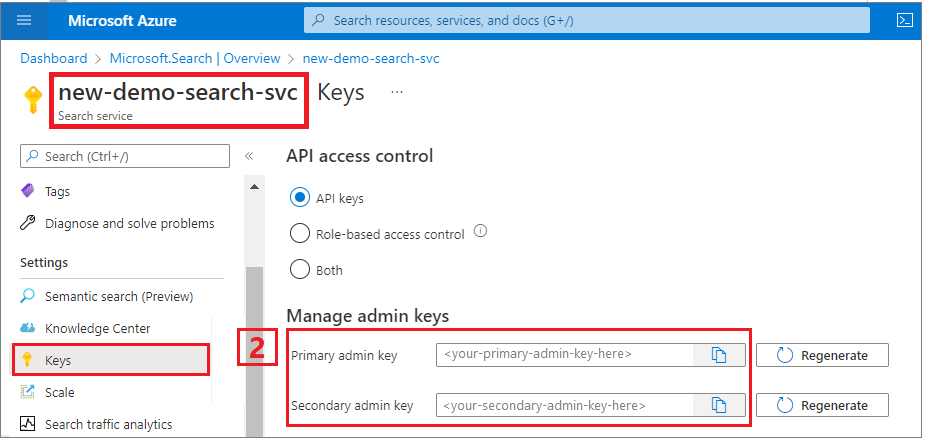

---
lab:
  title: REST API를 사용하여 벡터 검색 쿼리 실행
---

# REST API를 사용하여 벡터 검색 쿼리 실행

이 연습에서는 프로젝트를 설정하고, 인덱스를 만들고, 문서를 업로드하고, 쿼리를 실행합니다.

이 연습을 성공적으로 수행하려면 다음이 필요합니다.

- [Postman](https://www.postman.com/downloads/) 앱
- Azure 구독
- Azure AI 검색 서비스
- [Postman 샘플 컬렉션](https://github.com/Azure/cognitive-search-vector-pr/tree/main/postman-collection) *Vector-Search-Quickstart.postman_collection v1.0 json*.

> **참고** 필요한 경우 Postman 앱에 대한 자세한 내용은 [여기](https://learn.microsoft.com/en-us/azure/search/search-get-started-rest)에서 확인할 수 있습니다.

## 프로젝트 설정

먼저 다음 단계를 수행하여 프로젝트를 설정합니다.

1. Cognitive Search 서비스의 **URL** 및 **키**를 확인합니다.

    

1. [Postman 샘플 컬렉션](https://github.com/Azure/cognitive-search-vector-pr/tree/main/postman-collection)을 다운로드합니다. 
1. Postman을 열고 **가져오기** 단추를 선택하여 컬렉션을 가져오고 컬렉션 폴더를 상자에 끌어서 놓습니다.

    

1. 컬렉션의 포크를 만들고 고유한 이름을 추가하려면 **포크** 단추를 선택합니다.
1. 컬렉션 이름을 마우스 오른쪽 단추로 클릭하고 **편집**을 선택합니다.
1. **변수** 탭을 선택하고 Cognitive Search 서비스의 검색 서비스 및 인덱스 이름을 사용하여 다음 값을 입력합니다.

    

1. **저장** 단추를 선택하여 변경 내용을 저장합니다.

Azure Cognitive Search 서비스에 요청을 보낼 준비가 되었습니다.

## 인덱스 만들기

다음으로, Postman에서 인덱스를 만듭니다.

1. 사이드 메뉴에서 **PUT 인덱스 만들기/업데이트**를 선택합니다.
1. 앞서 확인한 **search-service-name**, **index-name** 및 **api-version**으로 URL을 업데이트합니다.
1. 응답을 보려면 **본문** 탭을 선택합니다.
1. URL의 인덱스 이름 값으로 **index-name**을 설정하고 **보내기**를 선택합니다.

요청이 성공했음을 나타내는 **200** 형식의 상태 코드가 표시되어야 합니다.

## 문서 업로드

문서 업로드 요청에는 108개의 문서가 포함되어 있으며 각 문서에는 **titleVector** 및 **contentVector** 필드에 대한 전체 포함 집합이 있습니다.

1. 사이드 메뉴에서 **POST 문서 업로드**를 선택합니다.
1. 이전과 같이 **search-service-name**, **index-name** 및 **api-version**으로 URL을 업데이트합니다.
1. **본문** 탭을 선택하여 응답을 확인하고 **보내기**를 선택합니다.

요청이 성공했음을 나타내려면 **200** 형식의 상태 코드가 표시되어야 합니다.

## 쿼리 실행

1. 이제 사이드 메뉴에서 다음 쿼리를 실행해 봅니다. 이렇게 하려면 이전처럼 매번 URL을 업데이트하고 **보내기**를 선택하여 요청을 보내야 합니다.

    - 단일 벡터 검색
    - 필터를 사용한 단일 벡터 검색
    - 간단한 하이브리드 검색
    - 필터를 사용한 간단한 하이브리드 검색
    - 교차 필드 검색
    - 다중 쿼리 검색

1. 응답과 결과를 보려면 **본문** 탭을 선택합니다.

요청이 성공하면 **200** 형식의 상태 코드가 표시됩니다.
